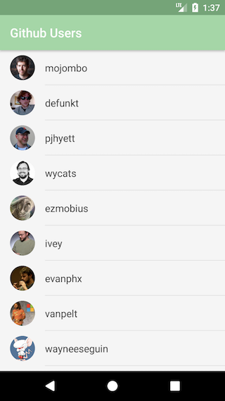
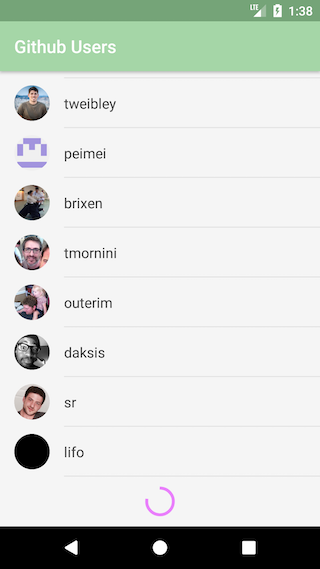

# Github MVP - Android

This project is meant to be an example of how you can implement an Android applicaiton using the Model View Presenter (MVP) design pattern. This project contains examples of each portion of the pattern including models, views, presenters, and data sources. Each of these components also comes with a full suite of unit tests.

## Screenshots

